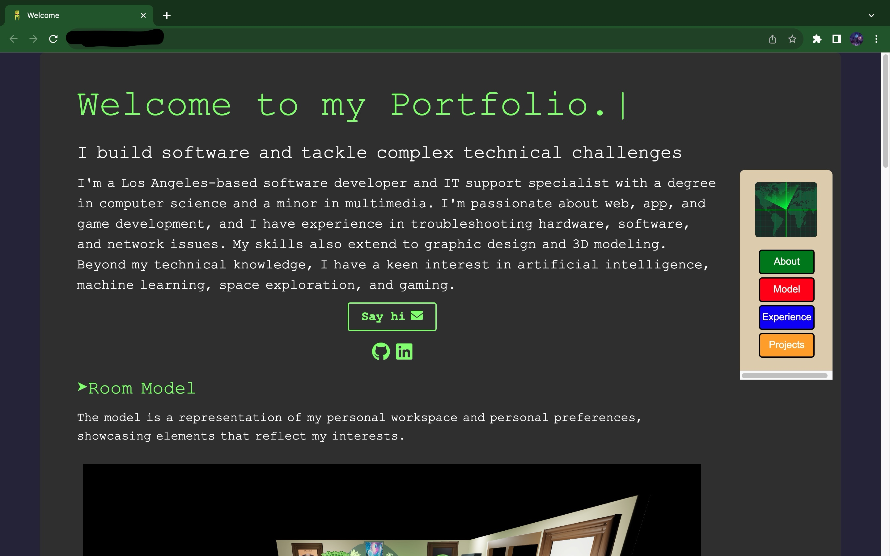

<h1 align="center">
  myportfolio - v1
</h1>
<p>Built using Vite and React, my personal portfolio showcases my projects while serving as a canvas for continual skill growth. Your valuable feedback is immensely appreciated as I strive for continual improvement. Thank you ^•ﻌ•^ฅ!</p>



## 💻 set-up

1. Install the dependencies

   ```sh
   npm install or yarn install
   ```

2. Start the development server

   ```sh
   yarn dev or npm start
   ```

### Please Note

```sh
"scripts": {
"dev": "vite --host",
"build": "vite build",
"lint": "eslint . --ext js,jsx --report-unused-disable-directives --max-warnings 0",
"preview": "vite preview"
},
```

`If you want to test your react web app on a local server running on your network and also test it on your mobile device leave the script exactly the way you see it above.`

### If not change the following:

```sh
   "dev": "vite --host",
```

### to:

```sh
   "dev": "vite",
```

### Script is located in the package.json file
